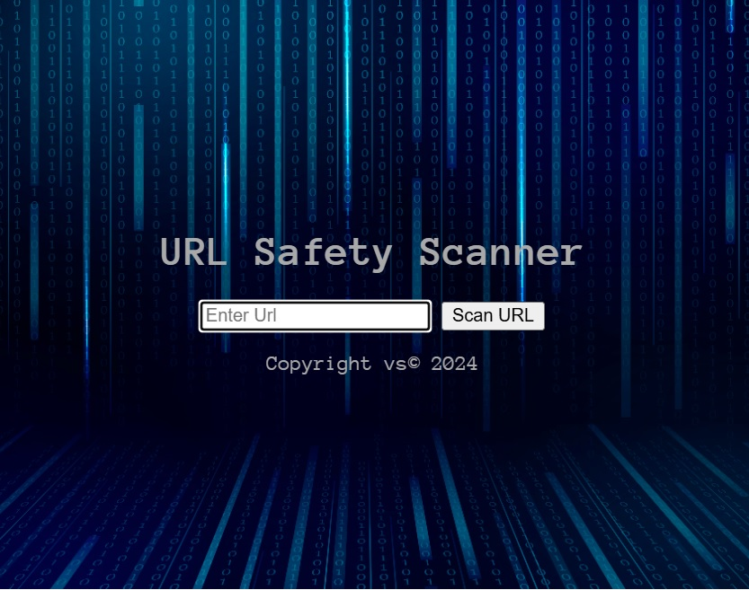
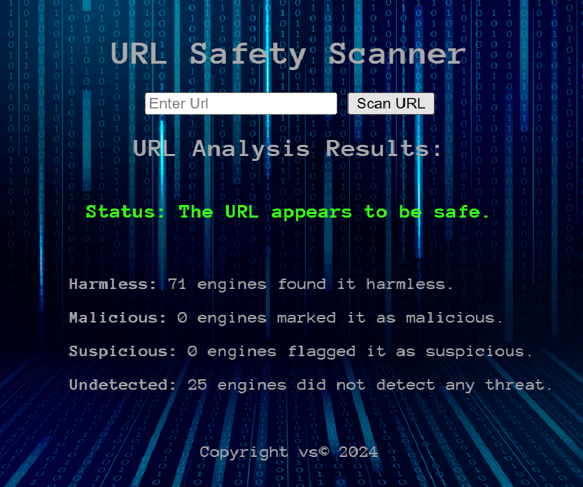
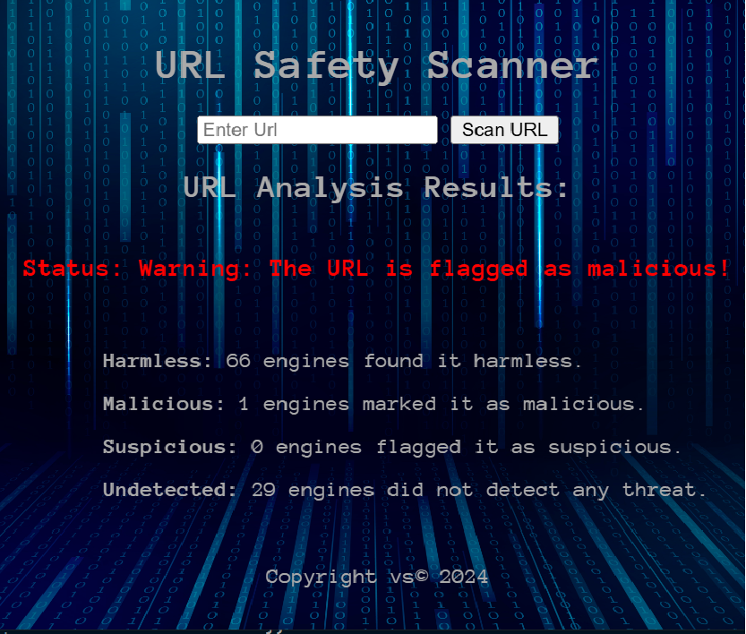

# SafeURL-Scanner

This is a Web Application that lets users to check the safety of urls 
through [Virustotal API](https://docs.virustotal.com/reference/overview). 
Just enter a URL to the provided form, and the 
app will return a detailed analysis of whether the link is safe or 
potentially harmful, helping you avoid malicious or suspicious content.

The app is hosted on Render.com, with CI/CD pipelines and automated tests set up for 
 deployment, ensuring the app is continuously updated with the latest changes. 

## Accessing the App

Note: The app might take up to 50 seconds to load when opened first time, 
as it may need to "warm up" after being idle or provisioned by the hosting 
platform. Subsequent loads should be faster.

You can access the app here: [URL Safety Scanner](https://url-safety-scanner.onrender.com/)

## Tech Details

**Node.js**: The backend is powered by Node.js, providing a fast and scalable runtime for handling HTTP requests.
- **Express**: A minimal and flexible web framework for Node.js, used to build the app's routes and handle user requests.
- **EJS (Embedded JavaScript)**: Used for rendering dynamic views and templates on the frontend, allowing seamless integration of data from the backend.
- **Axios**: A promise-based HTTP client for making requests to the VirusTotal API, enabling URL safety scans and analysis.
- **Render.com**: The app is hosted on Render, a cloud platform that offers automatic deployment and scaling.

- **Jest**: A JavaScript testing framework used to automate the testing of the app, ensuring the application functions as expected before deployment.
